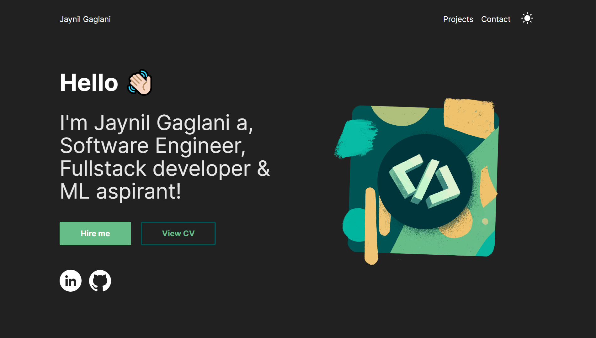

# Personal Profile

## Introduction

This repository consists of backend and frontend of my personal single page profile. It is hosted on Netlfiy and Heroku
It is made using `HTML, CSS, JavaScript, React, Styled Components, Gatsby` to design and develop this application.

## Live Demo

View the live demo of the application here 👉 [personal-profile](https://jaynil-profile.netlify.app/)
Backend is hosted on Heroku app 👉 [heroku-backend](https://jaynil-profile.herokuapp.com/)

## Application View

## Technologies Used

- HTML
- CSS
- JavaSript
- React
- Styled Components
- Gatsby

## Run Application

- Clone the repository
- Go to the cloned folder
- Run the `npm install && npm start` in profile-frontend and profile-backend folders to get started

## 👤 **Jaynil Gaglani**

- Portfolio: [jaynil.gaglani](https://bit.ly/jaynil-profile)
- Linkedin: [Jaynil Gaglani](https://www.linkedin.com/in/jaynilgaglani/)
- Github: [@Jaynil1611](https://github.com/Jaynil1611)

## Show your support

Give a ⭐️ if you like this repository!

Made with ❤️ by Jaynil Gaglani
